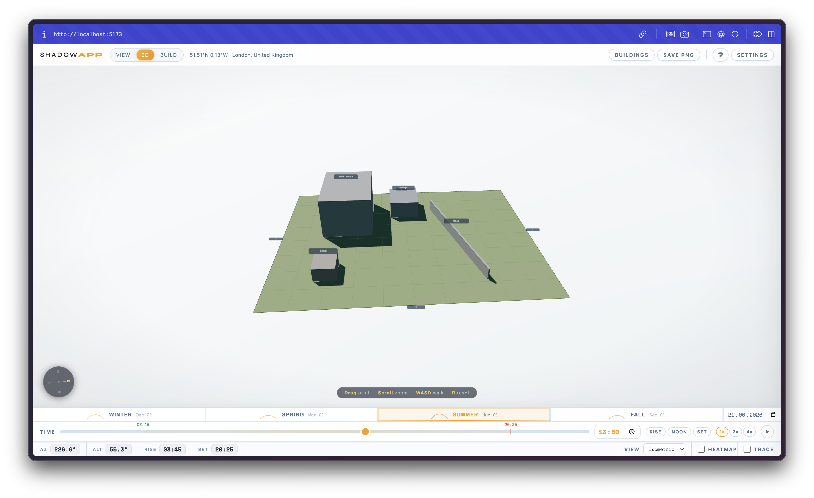
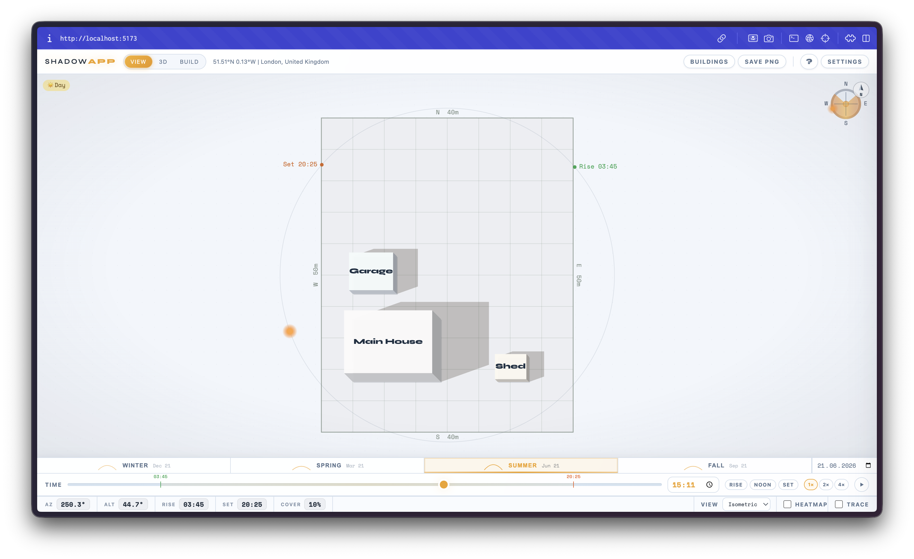

# shadowAPP

a tool for visualising sun and shadow on your plot throughout the day. built it because i wanted to know which parts of my garden actually get sun in winter vs summer.

you pick a location, set up your buildings, and drag the time slider to see how shadows move. there's also a 3D view.

## what it does

- sun position calculated from real solar math (azimuth + altitude)
- shadow projection for buildings and walls
- trace overlay so you can see where shadows fall over a whole day
- heatmap showing which spots get the most sun
- 3D view with Three.js (WASD to walk around)
- pick any date or jump to solstices/equinoxes
- multiple saved projects, share via URL

## running it

```
npm install
npm run dev
```

build for prod:

```
npm run build
```

## stack

Vite + TypeScript, canvas 2D for the main view, Three.js for 3D, Leaflet for the map picker.


